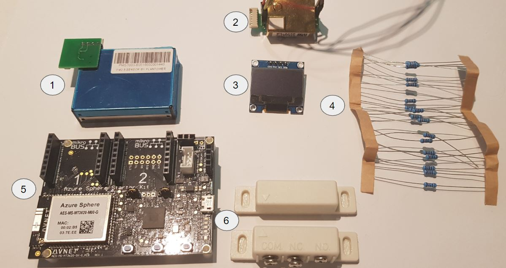

# Azure Sphere Code to read my Sensors
## This Azure Function was created for the [Sensing the World Element14 competition](https://www.element14.com/community/groups/azuresphere/blog/2019/11/29/sensing-my-rooms-air-quality-co2-dust). A full tutorial is available there.

# Parts List

1. [PMS-7003 Dust Sensor](https://www.aliexpress.com/item/32623909733.html)
2. [MH-Z19 CO2 Sensor](https://www.aliexpress.com/item/32946106807.html)
3. [OLED screen](https://www.aliexpress.com/item/32844104782.html)
4. [10K resistor](https://au.element14.com/multicomp/mcmf006ff1002a50/res-10k-1-600mw-axial-metal-film/dp/2401780)
5. [Azure Sphere MT3620 Starter Kit](https://www.newark.com/avnet/aes-ms-mt3620-sk-g/starter-kit-arm-cortex-a7-cortex/dp/02AH9206)
6. [Reed Switch](https://www.altronics.com.au/p/s5153-spdt-surface-mount-security-reed-switch/)

# Description
This is the required C code to allow the Azure Sphere to collect information from a CO2 sensor, a dust sensor and a reed switch, transmit that to Azure IOT Hub and accept direct method calls from Azure IOT Hub to permamently change the polling time of these sensors with no required changes to the code.

It was written with Visual Studio Code 2017 with the [Azure Sphere SDK Preview for Visual Stuido](https://marketplace.visualstudio.com/items?itemName=AzureSphereTeam.AzureSphereSDKforVisualStudio). Configurations outside of this are untested.

# Usage
It's best to look at the [Sensing the World submission page]((https://www.element14.com/community/groups/azuresphere/blog/2019/11/29/sensing-my-rooms-air-quality-co2-dust)) for a full writeup, but in general you will need to
* [Set up your Azure Sphere, either follow my guide in the submsission or Microsofts guide](https://docs.microsoft.com/en-us/azure-sphere/install/overview)
* Provision an IOT Hub (for a single device, free tier is fine)
* Add your IOT Hub connection string to ```connection_strings.h```, and add your IOT Hub fully qualified domain name to ```app_manifest.json```